### Kafka的安装

官网 kafka.apache.org

启动前，修改kafka的配置文件，也就是修改server.properties，位于config文件夹下。将zk的连接调整到已经启动zk服务的端口状态。

启动的时候，请确保zk已经启动，然后使用命令

```
sh kafka-server-start.sh ../config/server.properties
```

不过出现的最常见的就是超时操作，这个时间我们需要把超时的时间改长一点就好。

```
zookeeper.connection.timeout.ms=6000000
```

不过需要注意的是，如果你是在本机启动的zk与本地启动的kafka的情况下，以上配置已经可以满足你需求，但是如果，zk与kafka部署在不同的机器上，你就需要配置额外的参数

```properties
# The address the socket server listens on. It will get the value returned from 
# java.net.InetAddress.getCanonicalHostName() if not configured.
#   FORMAT:
#     listeners = listener_name://host_name:port
#   EXAMPLE:
#     listeners = PLAINTEXT://your.host.name:9092
#listeners=PLAINTEXT://:9092  <--此为本机上启动的配置，如果你是不同节点的zk那么就需要另外配置
listeners=PLAINTEXT://192.168.0.102:9092
# 9092 就是kafka默认端口号。
```

从zooView上也可以看到这个的变化


那如果我们先命令行去创建一个消息的话，可以输入以下指令。

```
[root@localhost bin]# sh kafka-topics.sh  --create --zookeeper 192.168.0.102:2182 --replication-factor 1 --partitions 1 --topic test
```

前面是创建zk连接，后面是副本的一些信息，然后topic是组的名字，kafka中topic意味组别，也就是表示分类的意思。

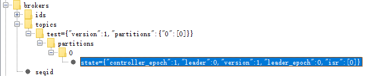

但实际业务中，应该是具体的类别，例如体育或者新闻之类的信息来搞定。

然后我们要消费这个信息，也就是意味着对这个节点进行监听。

```
[root@localhost bin]# sh kafka-console-consumer.sh --bootstrap-server 192.168.0.102:9092 --topic test --from-beginning
```

这样就监听完成。然后我们就开始生产消息给这个监听者。

```
[root@localhost bin]# sh kafka-console-producer.sh  --broker-list 192.168.0.102:9092 --topic test
```

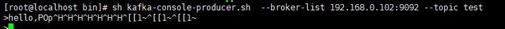

然后消费端也就收到了消息。

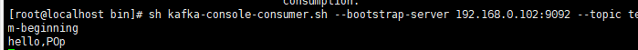

```
ps -ef|grep kafka
kill -9 xxx
```

#### 关于kafka的集群

首先三个kafka我先保证三个文件的内容保持一致，即Server.properties

然后我们需要修改

```
broker.id=1
```

和zk的myid一样，要保证每个节点不一样，然后就是

```
listeners=PLAINTEXT://192.168.0.102:9092
```

每个节点请改成自己的本地的ip，和端口号，如果是一台机器，请注意端口号的冲突问题。

### Kafka 的应用

引入依赖

```xml
<dependency>
            <groupId>org.apache.kafka</groupId>
            <artifactId>kafka-clients</artifactId>
            <version>2.0.0</version>
        </dependency>
```

然后生产者的代码

```java
package com.pop.kafka.kafkapractice;

import org.apache.kafka.clients.producer.KafkaProducer;
import org.apache.kafka.clients.producer.ProducerConfig;
import org.apache.kafka.clients.producer.ProducerRecord;
import org.apache.kafka.clients.producer.RecordMetadata;
import org.apache.kafka.common.serialization.IntegerSerializer;
import org.apache.kafka.common.serialization.StringSerializer;

import java.util.Properties;
import java.util.concurrent.ExecutionException;
import java.util.concurrent.TimeUnit;

/**
 * @author Pop
 * @date 2019/8/19 17:52
 */
public class PopKafkaProducer extends Thread{

    KafkaProducer<Integer,String> producer;
    String topic;//主题

    public PopKafkaProducer(String topic) {

        Properties properties = new Properties();

        //集群条件用逗号隔开，和原本的server.properties的提示一样
        properties.put(ProducerConfig.BOOTSTRAP_SERVERS_CONFIG,
                "192.168.0.102:9092");
        properties.put(ProducerConfig.CLIENT_ID_CONFIG,"pop-producer");
        //申明序列化的方式， 分别是key和value
        properties.put(ProducerConfig.KEY_SERIALIZER_CLASS_CONFIG, IntegerSerializer.class.getName());
        properties.put(ProducerConfig.VALUE_SERIALIZER_CLASS_CONFIG, StringSerializer.class.getName());

        producer = new KafkaProducer<Integer, String>(properties);

        this.topic = topic;
    }

    @Override
    public void run() {

        int num = 0;
        String msg = "";
        while(num<20){
            try {
                msg = "pop kafka practice msg :"+num;
                //get 会拿到执行结果。
                RecordMetadata recordMetadata=producer.send(new ProducerRecord<>(topic,msg)).get();
                System.out.println(recordMetadata.offset()+"->"+recordMetadata.partition()+"->"+recordMetadata.topic());
                TimeUnit.SECONDS.sleep(4);
                ++num;
            } catch (InterruptedException e) {
                e.printStackTrace();
            } catch (ExecutionException e) {
                e.printStackTrace();
            }
        }
    }

    public static void main(String[] args) {
        new PopKafkaProducer("test").start();
    }
}

```

消费端的代码

```java
package com.pop.kafka.kafkapractice;

import org.apache.kafka.clients.consumer.ConsumerConfig;
import org.apache.kafka.clients.consumer.ConsumerRecords;
import org.apache.kafka.clients.consumer.KafkaConsumer;
import org.apache.kafka.clients.producer.KafkaProducer;
import org.apache.kafka.clients.producer.ProducerConfig;
import org.apache.kafka.common.serialization.IntegerSerializer;
import org.apache.kafka.common.serialization.StringSerializer;

import java.time.Duration;
import java.util.Collections;
import java.util.Properties;

/**
 * @author Pop
 * @date 2019/8/19 17:52
 */
public class PopKafkaConsumer extends Thread{

    KafkaConsumer<Integer,String> consumer;
    String topic;

    public PopKafkaConsumer(String topic) {

        Properties properties = new Properties();

        //集群条件用逗号隔开，和原本的server.properties的提示一样
        properties.put(ConsumerConfig.BOOTSTRAP_SERVERS_CONFIG,
                "192.168.0.102:9092");
        properties.put(ConsumerConfig.CLIENT_ID_CONFIG,"pop-consumer");
        //分组
        properties.put(ConsumerConfig.GROUP_ID_CONFIG,"pop-gid");
        //超时时间
        properties.put(ConsumerConfig.SESSION_TIMEOUT_MS_CONFIG,"30000");
        //自动提交的间隔
        properties.put(ConsumerConfig.AUTO_COMMIT_INTERVAL_MS_CONFIG,"1000");


          //申明饭序列化的方式， 分别是key和value
        properties.put(ConsumerConfig.KEY_DESERIALIZER_CLASS_CONFIG, IntegerDeserializer.class.getName());
        properties.put(ConsumerConfig.VALUE_DESERIALIZER_CLASS_CONFIG, StringDeserializer.class.getName());

        properties.put(ConsumerConfig.AUTO_OFFSET_RESET_CONFIG,"earliest");

        consumer = new KafkaConsumer<Integer, String>(properties);


        this.topic = topic;
    }

    @Override
    public void run() {
        consumer.subscribe(Collections.singleton(this.topic));
        while(true){//不停的拿服务
            ConsumerRecords<Integer,String> consumerRecords=consumer.poll(Duration.ofSeconds(1));
            consumerRecords.forEach(record->{
                System.out.println(record.key()+"->"+
                        record.value()+"->"+record.offset());
            });
        }
    }

    public static void main(String[] args) {
        new PopKafkaConsumer("test").start();
    }

}

```

你也可以用异步的方法获得请求，kafka默认是异步的，只不过你可以通过get方法来获得同步的方式。

```java
 //异步的操作可以调用回调方法
                producer.send(new ProducerRecord<>(topic, msg), (metadata, execption) -> {
                    System.out.println(recordMetadata.offset()+"->"+recordMetadata.partition()+"->"+recordMetadata.topic());
                });
```

同时，在设置异步的时候，我们还需要配置一些其他参数，就是批处理。

```java
 //批量发送
      properties.put(ProducerConfig.BATCH_SIZE_CONFIG,"");
        //如果不可达会如何 间隔时间
        properties.put(ProducerConfig.LINGER_MS_CONFIG,"");
```

当然，以上方法是属于p2p，也就是点对点，如果我们启动了两个消费者是否都可以收到订阅后的消息呢，答案是否定的。

如果你希望两个消费者都可以收到订阅的消息，就需要按组区别开来

```java
 properties.put(ConsumerConfig.BOOTSTRAP_SERVERS_CONFIG,
                "192.168.0.102:9092");
//这里就需要修改了
        properties.put(ConsumerConfig.CLIENT_ID_CONFIG,"pop-consumer");
```

不同的组才可以都收到消息，同一个组有一个收到消息。


### SpringBoot 与 kafka的整合

```XML
 <dependency>
            <groupId>org.springframework.kafka</groupId>
            <artifactId>spring-kafka</artifactId>
            <version>2.2.0.RELEASE</version>
        </dependency>
```

配置文件

```properties
spring.kafka.producer.value-serializer=org.apache.kafka.common.serialization.StringSerializer
spring.kafka.producer.key-serializer=org.apache.kafka.common.serialization.IntegerSerializer

spring.kafka.bootstrap-servers=192.168.0.102:9092

spring.kafka.consumer.group-id=springboot-groupid
spring.kafka.consumer.auto.offset-reset=earliest
spring.kafka.consumer.enable-auto-commit=true

spring.kafka.consumer.key-deserializer=org.apache.kafka.common.serialization.IntegerDeserializer
spring.kafka.consumer.value-deserializer=org.apache.kafka.common.serialization.StringDeserializer

```

生产者

```java
@Component
public class PopKafkaProducer {

    @Autowired
    private KafkaTemplate<String,String> kafkaTemplate;

    public void send(){
        kafkaTemplate.send("test","msgkey");
    }
}
```

消费者。

```java
@Component
public class PopKafkaConsumer {

    @KafkaListener(topics = {"test"})
    public void listener(ConsumerRecord record){
        Optional msg = Optional.ofNullable(record.value());
        if(msg.isPresent()){
            System.out.println(msg.get());
        }
    }

}
```

```java
@SpringBootApplication
public class KafkapracticeApplication {

    public static void main(String[] args) throws InterruptedException {
//        SpringApplication.run(KafkapracticeApplication.class, args);
        ConfigurableApplicationContext context
                 = SpringApplication.run(KafkapracticeApplication.class, args);
        PopKafkaProducer kp = context.getBean(PopKafkaProducer.class);
        for (int i = 0; i < 10; i++) {
            kp.send();
            TimeUnit.SECONDS.sleep(2);
        }

    }

}
```

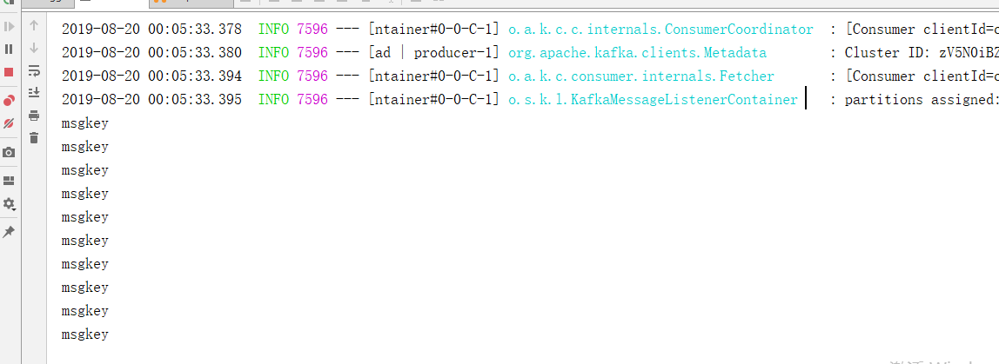

### Kafka中的分区做法

kafka可以支撑千亿级别数据量的topic，对于我们而言，如果一个topic真的有千亿的数据，查询效率也不会高到哪里去，数据库中我们可以用分库分表的方式来处理，当一张表到达百万级别的时候，就会出现瓶颈，所以我们会用时间算法或者hash算法来规定具体落到哪个库或者表中。

kafka中，提供了一种分片的方式，partition

我们可以在命令行加入、

```
[root@localhost bin]# sh kafka-topics.sh  --create --zookeeper 192.168.0.102:2182 --replication-factor 1 --partitions 3 --topic test_partitions
```

区别在于partitions中加入了3，表示会为这个topic创建三个分区。

而在java代码中，我们可以有自己定义的算法来规定具体会落到哪个分区中。

```java
public class MyPartition implements Partitioner {

    @Override
    public int partition(String s, Object o, byte[] bytes, Object o1, byte[] bytes1, Cluster cluster) {
        /**
         * 这个方法为核心方法，返回值代表会落到具体哪个分区
         * 如果是0 就是 1号分区，依次类推
         */
        System.out.println("enter");
        //获得这个topic的所有分区
        List<PartitionInfo> list=cluster.partitionsForTopic(s);
        int len = list.size();
        if(o==null){//我们在发送消息的时候会指定key和value，key如果指定了的话
            //kafka会根据key，计算，如果没有，也会有默认的计算方式
            Random random = new Random();
            return random.nextInt(len);
        }
        return Math.abs(o.hashCode())%len;
    }

    @Override
    public void close() {

    }

    @Override
    public void configure(Map<String, ?> map) {

    }
}
```

接着在生产者放，加入相关配置。

```java

        //集群条件用逗号隔开，和原本的server.properties的提示一样
        properties.put(ProducerConfig.BOOTSTRAP_SERVERS_CONFIG,
                "192.168.0.102:9092");
        properties.put(ProducerConfig.CLIENT_ID_CONFIG,"pop-producer");

        //自定义的分区算法方式
   properties.put(ProducerConfig.PARTITIONER_CLASS_CONFIG,"com.pop.kafka.kafkapractice.spring.MyPartition");
```

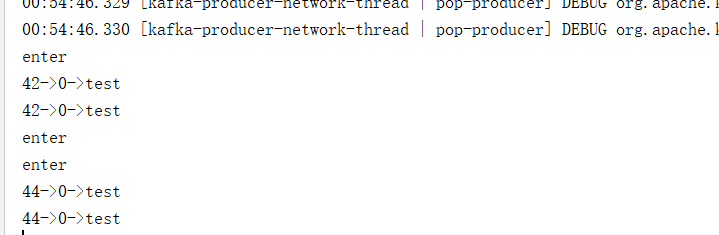

之前我们说过topic中的内容，可以做分区，而我们知道处于同一个groupid的consumer无法享用所有的消息队列的，除非你有富裕的topic分发给你消费。

例如，我们之前创建了含有三个分区的test_partitions，那么意味着

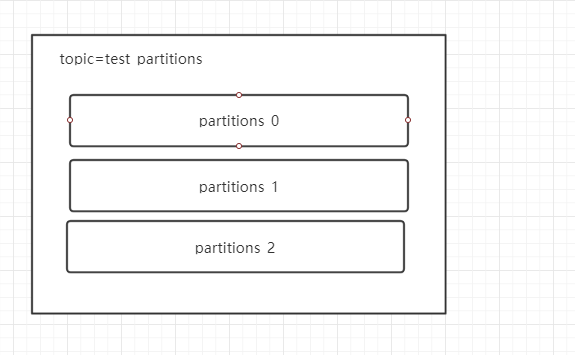

无论是集群环境还是单机环境下，都可以长成这样。

这里有三个分区，然后我们来讨论一下两个极端的场景。三个分区，一个消费者

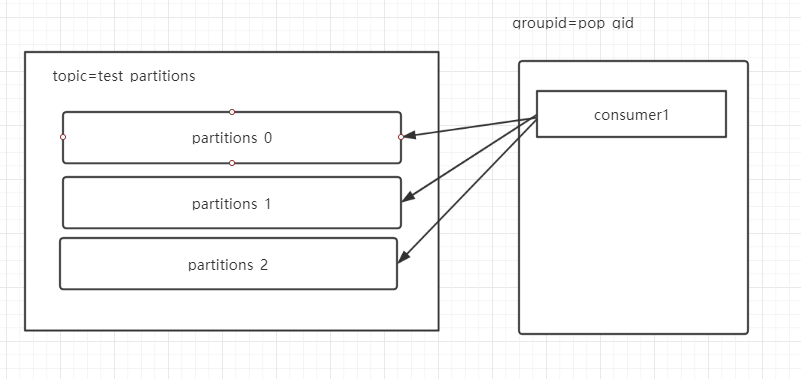

他会去消费三个分区的全部数据，然后就是三个消费者。

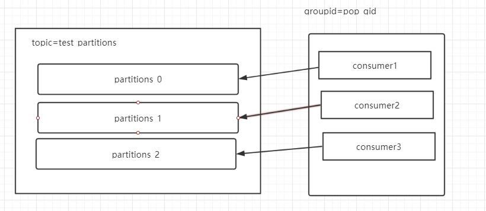

我们可以简单的认为他是固定好了，表示消费者1号就是消费分区0号的，这样很均匀的分配的，kafka里也是如此这般实现的。

那么如果是两个消费者的情况，那么意味着有一个消费者需要消费两个分区的内容。

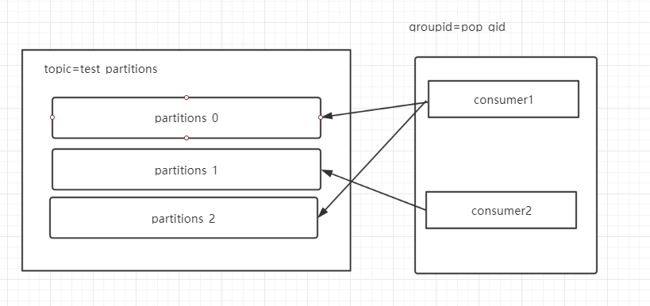

所以，我们可以联想到，如果超过了分区数量的消费者来了，例如是4个消费者，那么第四个消费者相比就没有东西可以消费，因为消息已经被前三个消费者消费完了，所以第四个消费为空闲。

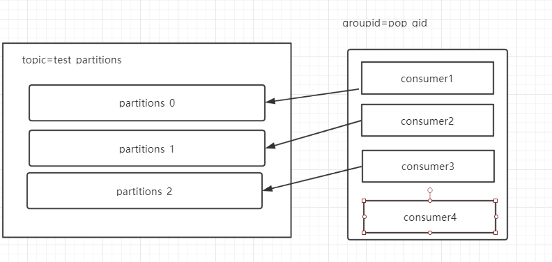

因此，如果你的消费者数量太多了，也是浪费，因为并没有多余的消息队列提供给你消费了。

需要注意的是，这里如果有新的消费者连接或者挂掉，都会重新负载，他们的请求将会发给以一个叫做coordinor的对象，他知道现在有多少topic还有该topic有多少分区。

不过这里讨论的情况是处于同一goupid的情况下。


### Kafka的实现原理

#### Topic

在Kafka中，Topic是一个很重要概念，他的主要含义我认为应该可以定义为`某一类消息的集合`。

例如，我们可以新闻做一个Topic，将娱乐作为一个Topic，他是一个逻辑上的概念，在kafka里，他是这一类消息类型的统称。他们的消息在物理层面上来说是分开存储的，一个topic可能多个生产者给他推送消息，同理，一个topic也可以被多个消费者消费。

#### Partition

我们以前说过Kafka可以支持千亿级别的数据体量，但我们如果将千亿级别的数据存在topic里面应该还是会恐怖的，在数据库中我们面对这么大的数据量的做法就是分库分表。在kafka里面，会使用`分区`这一概念来将Topic里面庞大的数据量拆分成若干个区域，这个拆分也是传统意义上将数据量拆分成不同的存储地方。

Rebalance

* 当分区数发生变化
* 消费者数量发生变化

#### 策略

* Range

  * test_topic 假设现在有是个分区，三个消费者
  * 分区为 0，1，2，3，4，5，6，7，8，9，消费者为 c1,c2,c3
  * 在这个算法中存在两个变量
    * n = 分区数量/消费者数量=10/3=3
    * m=分区数量%消费者数量=10%3=1
  * 这个算法就是，前m个消费者将会分配n+1个分区数量
  * 所以套入公式我们知道 c1 将会消费 0 1 2 3 四个分区，剩下的将会各消费3个
  * 这个做法缺点就是一定会有一个节点会多消费一个分区。

* RoundRobin（轮询）、

  * 轮询也许会把分区hash值计算出来。
  * 轮询的将会把所有的分区`循环`到各个消费者的身上
  * 还是三个消费者 c1 c2 c3，还是十个分区
  * c1  0  3  6 9
  * c2  1  4  7
  * c3  2  5   8

* Stricky（ 连制）

  * 尽可能均匀

  * 重新负载后，分区的分配尽可能和上一次分配保持一致

  * 这次是三个消费者，然后四个topic（t1,t2,t3,t4），每个topic有两个分区(p0,p1)

  * 如果是轮询的方式

    * c1 t0p0  t1p1  t3p0  
    * c2 t0p1  t2p0  t3p1  
    * c3 t1p0  t2p1 

  * 那么假设，现在c2消费者崩溃了，需要做重新的rebalance，轮询的方式，将会完完全全的重新分配，也就是说。

  * c1 t0p0  t1p1 

  * c3  t0p1  t1p2 ...

  * 但如果是stricky的话，会尽可能的保持和之前一样。  

  * c1 t0p0  t1p1  t3p0  t2p0

  * c3 t1p0  t2p1  t3p2  t3p1 

    

```java
public static final String PARTITION_ASSIGNMENT_STRATEGY_CONFIG = "partition.assignment.strategy";
//这个配置位于消费者中 ConsumerConfig
//对应的值有以上三种
```

消费端发起连接的时候，将会把自己的rebalance策略发送给kafka的一个中间人，他会裁决策略并最终给你哪个分区的给你消费。

所以这就可以解释一下，为什么同一个组的消费者无法重复消费消息，这是因为消息可能被同一组里面的其他消费者消费完了，又或者他正在消费的是和别人是不同的分区，总之，不会存在两个消费者消费统一分区的情况，如果消费者没有多余的分区可以消费，那么他只会干等着，浪费资源。

#### Coordinator

之前有谈及到topic和partition之间的关系，可以说topic可以多个partition的集合，而我们之前也说了三种消费者消费这些partition的策略，range，RoundRobin，Stricky。

但是如果一个topic之中有三个partition，而这个时候有三个消费者，这些消费都可以配置自己的消费策略，那么到底应该听谁的呢？

这个时候kafka提供了一个角色，就是coordinator，他会管理consumer group的中角色，当consumer group中的第一个consumer启动的时候，它会去和kafka server 确定谁是他们组的coordinator，之后该group内所有成员都会喝这个确定的coordinator进行通信，来进行接下来的操作。

接下来就是joingroup的过程

在重新负载（rebalance）之前，coordinator已经保证确定好，那么接下来就是正在负载的过程，也就是具体消费策略的落地。

* join：可以理解成，加入这个组的消费者所有成员会向这个确定好的coordinator发送joingroup请求，当所有成员都发送的请求，coordinator会选择一个consumer担任leader角色，并把这些消息发送给消费者。这个选举很简单，就是判断这个组如果没有leader，会选择第一个加入的consumer成为leader，如果这个leader因为某些原因退出了goup，那么会从conusmer随机选一个consumer再次成为leader

  由于之前说到，每个消费者都可以有自己的分区分配策略，为了统一策略，他们会将自己支持的策略发送给coordinator人，然后根据投票选出最后赞同的分配策略。

* sync：这个阶段也是 Synchronizing Group State 阶段，由于分区策略在coordinator最后完成了定夺后，会给消费者leader，他就把partition分配方案同步给consumer group 中的所有consumer。
  所以，这里的主要逻辑就是想GroupCoordinatro发送SyncGroupRequest 请求，并处理这个请求。最后组里的每个消费者将会从leader节点拿到分配方案，这样所有成员都会知道自己消费哪一个分组了。

now-lastCaughtUpTimeMs>relica.lag.time.max.ms

提出ISR队列，如果下次小于阈值，将会重新加入。

我们再来总结一下consumer group rebalance的过程

* 对于每个consumer group子集，都会在服务端对应一个GroupCoordinator进行管理，
  GroupCoordinator会在zookeeper上添加watcher，当消费者加入或者退出consumer group时，会修
  改zookeeper上保存的数据，从而触发GroupCoordinator开始Rebalance操作
*  当消费者准备加入某个Consumer group或者GroupCoordinator发生故障转移时，消费者并不知道
  GroupCoordinator的在网络中的位置，这个时候就需要确定GroupCoordinator，消费者会向集群中的
  任意一个Broker节点发送ConsumerMetadataRequest请求，收到请求的broker会返回一个response
  作为响应，其中包含管理当前ConsumerGroup的GroupCoordinator，
*  消费者会根据broker的返回信息，连接到groupCoordinator，并且发送HeartbeatRequest，发送心
  跳的目的是要确定GroupCoordinator这个消费者是正常在线的。当消费者在指定时间内没有发送
  心跳请求，则GroupCoordinator会触发Rebalance操作。
*  发起join group请求，两种情况
  如果GroupCoordinator返回的心跳包数据包含异常，说明GroupCoordinator因为前面说的几种
  情况导致了Rebalance操作，那这个时候，consumer会发起join group请求
  新加入到consumer group的consumer确定好了GroupCoordinator以后
  消费者会向GroupCoordinator发起join group请求，GroupCoordinator会收集全部消费者信息之
  后，来确认可用的消费者，并从中选取一个消费者成为group_leader。并把相应的信息（分区分
  配策略、leader_id、…）封装成response返回给所有消费者，但是只有group leader会收到当前
  consumer group中的所有消费者信息。当消费者确定自己是group leader以后，会根据消费者的
  信息以及选定分区分配策略进行分区分配
  接着进入Synchronizing Group State阶段，每个消费者会发送SyncGroupRequest请求到
  GroupCoordinator，但是只有Group Leader的请求会存在分区分配结果，GroupCoordinator会
  根据Group Leader的分区分配结果形成SyncGroupResponse返回给所有的Consumer。
  consumer根据分配结果，执行相应的操作
  到这里为止，我们已经知道了消息的发送分区策略，以及消费者的分区消费策略和rebalance。对于应
  用层面来说，还有一个最重要的东西没有讲解，就是offset，他类似一个游标，表示当前消费的消息的
  位置。

#### offset

由于topic可以划分多个partition，在被消费者消费的可能是不同的分区，如果说发生了某个consumer挂掉，发生了rebalance后，下一个接手消费的consumer怎么知道上一个consumer消费到哪个位置了呢？

答案就是offset，offset可以记录不同分区的偏移量，即消费到具体的位置。

每个分区都有自己唯一的offset，即offset只在自己的分区的保持有序，与其他分区offset无关，当consumer消费完后，发生提交操作，就会保存消费到最近的一个offset。

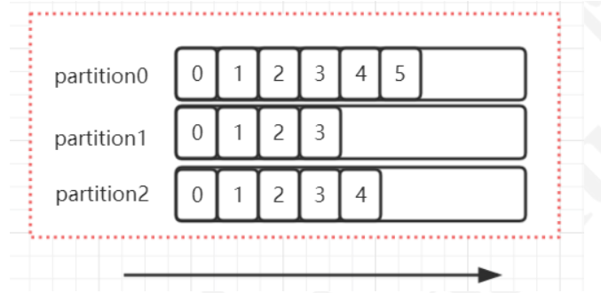

**那么这些offset会保存在哪里呢？**

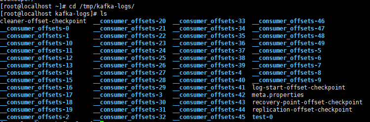

以linux操作系统为例子，kafka默认的server配置文件下的log文件位置下会有这些文件，offset就会维护在这个地方，如果是集群环境下，这个文件将会分摊在各自的机器中，默认总共50个。他们保存了group在某一时刻提交的offset信息。

我们之前曾经设置过这样一个参数。

```java
properties.put(ConsumerConfig.CLIENT_ID_CONFIG,"pop-consumer");
```

kafka中拥有这个一个计算公式，得到的数值会确定是那个一个__consumer-offsets-*的文件夹中去。这个consumer group 中的offset记录将会被保存。

`Math.abs(“groupid”.hashCode())%groupMetadataTopicPartitionCount` ; 由于默认情况下
groupMetadataTopicPartitionCount有50个分区。也就是

```java
System.out.println(Math.abs("pop-consumer".hashCode()%50)); //6
```

这个答案是6，所以就意味着这个消费组的offset会存放在__consumer-offsets-6文件中。

```
[root@localhost bin]# sh kafka-console-consumer.sh --topic __consumer_offsets --partition 6  --bootstrap-server 192.168.0.102:9092 --formatter 'kafka.coordinator.group.GroupMetadataManager$OffsetsMessageFormatter'
```

我们可以通过这个来查看这个的信息，也可以通过这个配置命令获得log的信息。

```
sh kafka-run-class.sh  kafka.tools.DumpLogSegments --files /tmp/kafka-logs/__consumer_offsets-5/00000000000000000000.log --print-data-log
```

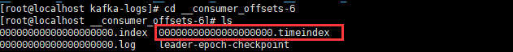

kafka里面，一般都会有三个文件.index,.log.timeindex文件，log文件将会记录所在分区，leader是谁，还有现在为止offset的位置等等信息。

而.index文件会存不同范围的值。

如果消息大一些，这个值可能会变成000000003690.log之类，而index中会存0-999 序号的信息对应的offset是0-499这样的，类似二分法的这样查找。

#### 副本机制

topic中可能会有多个partition，集群环境下，如果你为一个topic创建了三个partition，然后分别放在三台机器上，这很自然，如果其中一台kafka挂掉了，那么一个parition分区的消息就无法消费，这样就可用性就不好了，所以这里有一个副本的机制。

副本机制，即一个parition会在集群环境下，在其他kafka节点（borker）下放置一个副本，当做是follwer，自己是leader，如果leader挂了，follwer盯上。follwer和leader的数据会保持的同步，这样就避免了当leader挂掉了，这个分区的消息无法消费的情况。

通过这个命名创建带有三个分区，且每个分区有两个副本的topic，名字为 secondTopic

红色为leader，其它为follwer

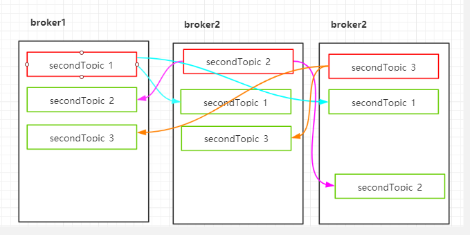

```
sh kafka-topics.sh --create --zookeeper 192.168.0.102:2181 --replication-factor
3 --partitions 3 --topic secondTopic
```

我们可以通过

```
get /brokers/topics/secondTopic/partitions/1/state
```

zk上查看当前leader是谁

```
{"controller_epoch":12,"leader":0,"version":1,"leader_epoch":0,"isr":[0,1]}
```

当然你也可以用

```
sh kafka-topics.sh --zookeeper 192.168.0.102:2181 --describe --topic
secondTopic
```

来查看。

#### 副本的Leader 选举

其实，像这种leader，follower的关系，一般都有选举还有数据同步。

Kafka提供了数据复制算法保证，如果leader副本所在的broker节点宕机或者出现故障，或者分区的
leader节点发生故障，这个时候怎么处理呢？
那么，kafka必须要保证从follower副本中选择一个新的leader副本。那么kafka是如何实现选举的呢？
要了解leader选举，我们需要了解几个概念
Kafka分区下有可能有很多个副本(replica)用于实现冗余，从而进一步实现高可用。副本根据角色的不同
可分为3类：

* leader副本：响应clients端读写请求的副本
* follower副本：被动地备份leader副本中的数据，不能响应clients端读写请求。
* ISR副本：包含了leader副本和所有与leader副本保持同步的follower副本——如何判定是否与leader同
  步后面会提到每个Kafka副本对象都有两个重要的属性：LEO和HW。注意是所有的副本，而不只是
  leader副本。
* LEO：即日志末端位移(log end offset)，记录了该副本底层日志(log)中下一条消息的位移值。注意是下
  一条消息！也就是说，如果LEO=10，那么表示该副本保存了10条消息，位移值范围是[0, 9]。另外，
  leader LEO和follower LEO的更新是有区别的。我们后面会详细说
* HW：即上面提到的水位值。对于同一个副本对象而言，其HW值不会大于LEO值。小于等于HW值的所
  有消息都被认为是“已备份”的（replicated）。同理，leader副本和follower副本的HW更新是有区别的

> 从生产者发出的 一 条消息首先会被写入分区的leader 副本，不过还需要等待ISR集合中的所有
> follower副本都同步完之后才能被认为已经提交，之后才会更新分区的HW, 进而消费者可以消费
> 到这条消息。

#### 副本协同机制

刚刚提到了，消息的读写操作都只会由leader节点来接收和处理。follower副本只负责同步数据以及当
leader副本所在的broker挂了以后，会从follower副本中选取新的leader。
写请求首先由Leader副本处理，之后follower副本会从leader上拉取写入的消息，这个过程会有一定的
延迟，导致follower副本中保存的消息略少于leader副本，但是只要没有超出阈值都可以容忍。但是如
果一个follower副本出现异常，比如宕机、网络断开等原因长时间没有同步到消息，那这个时候，
leader就会把它踢出去。kafka通过ISR集合来维护一个分区副本信息

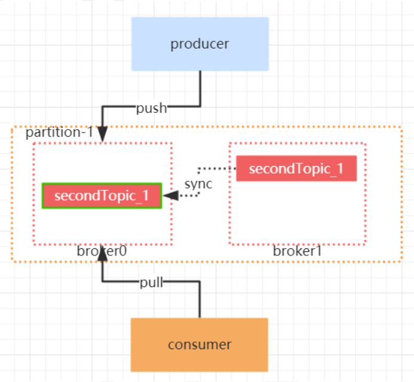

一个新leader被选举并被接受客户端的消息成功写入。Kafka确保从同步副本列表中选举一个副本为
leader；leader负责维护和跟踪ISR(in-Sync replicas ， 副本同步队列)中所有follower滞后的状态。当
producer发送一条消息到broker后，leader写入消息并复制到所有follower。消息提交之后才被成功复
制到所有的同步副本。

#### ISR

ISR表示目前“可用且消息量与leader相差不多的副本集合，这是整个副本集合的一个子集”。怎么去理解
可用和相差不多这两个词呢？具体来说，ISR集合中的副本必须满足两个条件
1. 副本所在节点必须维持着与zookeeper的连接
2. 副本最后一条消息的offset与leader副本的最后一条消息的offset之间的差值不能超过指定的阈值
    (replica.lag.time.max.ms) replica.lag.time.max.ms：如果该follower在此时间间隔内一直没有追
    上过leader的所有消息，则该follower就会被剔除isr列表
3. ISR数据保存在Zookeeper的 /brokers/topics/partitions//state
    节点中
    follower副本把leader副本LEO之前的日志全部同步完成时，则认为follower副本已经追赶上了leader
    副本，这个时候会更新这个副本的lastCaughtUpTimeMs标识，kafk副本管理器会启动一个副本过期检
    查的定时任务，这个任务会定期检查当前时间与副本的lastCaughtUpTimeMs的差值是否大于参数
    replica.lag.time.max.ms 的值，如果大于，则会把这个副本踢出ISR集合

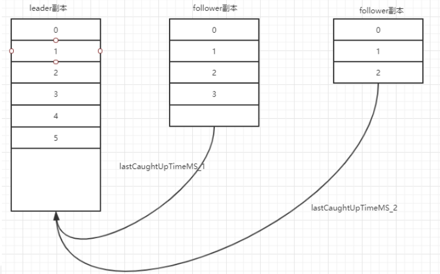

说一个极端的情况，即所有的Replica（副本）都不工作的情况，也就是，在ISR中，只有有一个follwer副本的时候，Kafka可以保证已经commit的数据不丢失，但是如果现在全部的Replica都宕机的情况下怎么办呢

，这样就无法保证数据不丢失了。

* 等待ISR中的任一Replica“活过来”，并选择他为leader
* 选择第一个“活”过来的Replica（不一定是ISR中的）作为Leader

这就需要在可用性和一致性当中作出一个简单的折衷。
如果一定要等待ISR中的Replica“活”过来，那不可用的时间就可能会相对较长。而且如果ISR中的所有
Replica都无法“活”过来了，或者数据都丢失了，这个Partition将永远不可用。
选择第一个“活”过来的Replica作为Leader，而这个Replica不是ISR中的Replica，那即使它并不保证已
经包含了所有已commit的消息，它也会成为Leader而作为consumer的数据源（前文有说明，所有读
写都由Leader完成）。在我们课堂讲的版本中，使用的是第一种策略。


#### 副本数据同步原理


标记为红色为Leader副本，其它为Follwer副本。

当Producer在发布某个消息到某个Partition的时候

* 通过zk找到该partition的Leader， get/brokers/topics//partitions/2/state，无论他的副本有多少个，都会生产者都会将消息发送给分区的Leader
* Leader收到消息后，将该消息写入本地log，每个Follwer会从Leader pull 数据，这种方式上，Follwer的数据的存储顺序与Leader保持一致。
* Follower收到消息，并写入日志Log成功后，向Leader发送ACK
* 一旦Leader收到了ISR中所有的Replica的ACK后，该消息可以被认为是已经被commit，Leader将会增加HW并且像Producer发送ACK