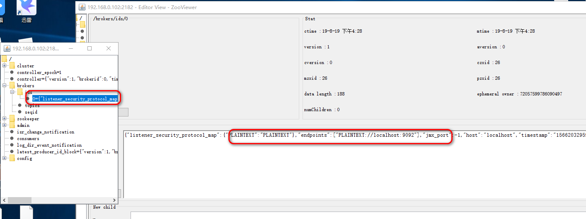

### Kafka的安装

官网 kafka.apache.org

启动前，修改kafka的配置文件，也就是修改server.properties，位于config文件夹下。将zk的连接调整到已经启动zk服务的端口状态。

启动的时候，请确保zk已经启动，然后使用命令

```
sh kafka-server-start.sh ../config/server.properties
```

不过出现的最常见的就是超时操作，这个时间我们需要把超时的时间改长一点就好。

```
zookeeper.connection.timeout.ms=6000000
```

不过需要注意的是，如果你是在本机启动的zk与本地启动的kafka的情况下，以上配置已经可以满足你需求，但是如果，zk与kafka部署在不同的机器上，你就需要配置额外的参数

```properties
# The address the socket server listens on. It will get the value returned from 
# java.net.InetAddress.getCanonicalHostName() if not configured.
#   FORMAT:
#     listeners = listener_name://host_name:port
#   EXAMPLE:
#     listeners = PLAINTEXT://your.host.name:9092
#listeners=PLAINTEXT://:9092  <--此为本机上启动的配置，如果你是不同节点的zk那么就需要另外配置
listeners=PLAINTEXT://192.168.0.102:9092
# 9092 就是kafka默认端口号。
```

从zooView上也可以看到这个的变化



那如果我们先命令行去创建一个消息的话，可以输入以下指令。

```
[root@localhost bin]# sh kafka-topics.sh  --create --zookeeper 192.168.0.102:2182 --replication-factor 1 --partitions 1 --topic test
```

前面是创建zk连接，后面是副本的一些信息，然后topic是组的名字，kafka中topic意味组别，也就是表示分类的意思。


但实际业务中，应该是具体的类别，例如体育或者新闻之类的信息来搞定。

然后我们要消费这个信息，也就是意味着对这个节点进行监听。

```
[root@localhost bin]# sh kafka-console-consumer.sh --bootstrap-server 192.168.0.102:9092 --topic test --from-beginning
```

这样就监听完成。然后我们就开始生产消息给这个监听者。

```
[root@localhost bin]# sh kafka-console-producer.sh  --broker-list 192.168.0.102:9092 --topic test
```


然后消费端也就收到了消息。


```
ps -ef|grep kafka
kill -9 xxx
```

#### 关于kafka的集群

首先三个kafka我先保证三个文件的内容保持一致，即Server.properties

然后我们需要修改

```
broker.id=1
```

和zk的myid一样，要保证每个节点不一样，然后就是

```
listeners=PLAINTEXT://192.168.0.102:9092
```

每个节点请改成自己的本地的ip，和端口号，如果是一台机器，请注意端口号的冲突问题。

### Kafka 的应用

引入依赖

```xml
<dependency>
            <groupId>org.apache.kafka</groupId>
            <artifactId>kafka-clients</artifactId>
            <version>2.0.0</version>
        </dependency>
```

然后生产者的代码

```java
package com.pop.kafka.kafkapractice;

import org.apache.kafka.clients.producer.KafkaProducer;
import org.apache.kafka.clients.producer.ProducerConfig;
import org.apache.kafka.clients.producer.ProducerRecord;
import org.apache.kafka.clients.producer.RecordMetadata;
import org.apache.kafka.common.serialization.IntegerSerializer;
import org.apache.kafka.common.serialization.StringSerializer;

import java.util.Properties;
import java.util.concurrent.ExecutionException;
import java.util.concurrent.TimeUnit;

/**
 * @author Pop
 * @date 2019/8/19 17:52
 */
public class PopKafkaProducer extends Thread{

    KafkaProducer<Integer,String> producer;
    String topic;//主题

    public PopKafkaProducer(String topic) {

        Properties properties = new Properties();

        //集群条件用逗号隔开，和原本的server.properties的提示一样
        properties.put(ProducerConfig.BOOTSTRAP_SERVERS_CONFIG,
                "192.168.0.102:9092");
        properties.put(ProducerConfig.CLIENT_ID_CONFIG,"pop-producer");
        //申明序列化的方式， 分别是key和value
        properties.put(ProducerConfig.KEY_SERIALIZER_CLASS_CONFIG, IntegerSerializer.class.getName());
        properties.put(ProducerConfig.VALUE_SERIALIZER_CLASS_CONFIG, StringSerializer.class.getName());

        producer = new KafkaProducer<Integer, String>(properties);

        this.topic = topic;
    }

    @Override
    public void run() {

        int num = 0;
        String msg = "";
        while(num<20){
            try {
                msg = "pop kafka practice msg :"+num;
                //get 会拿到执行结果。
                RecordMetadata recordMetadata=producer.send(new ProducerRecord<>(topic,msg)).get();
                System.out.println(recordMetadata.offset()+"->"+recordMetadata.partition()+"->"+recordMetadata.topic());
                TimeUnit.SECONDS.sleep(4);
                ++num;
            } catch (InterruptedException e) {
                e.printStackTrace();
            } catch (ExecutionException e) {
                e.printStackTrace();
            }
        }
    }

    public static void main(String[] args) {
        new PopKafkaProducer("test").start();
    }
}

```

消费端的代码

```java
package com.pop.kafka.kafkapractice;

import org.apache.kafka.clients.consumer.ConsumerConfig;
import org.apache.kafka.clients.consumer.ConsumerRecords;
import org.apache.kafka.clients.consumer.KafkaConsumer;
import org.apache.kafka.clients.producer.KafkaProducer;
import org.apache.kafka.clients.producer.ProducerConfig;
import org.apache.kafka.common.serialization.IntegerSerializer;
import org.apache.kafka.common.serialization.StringSerializer;

import java.time.Duration;
import java.util.Collections;
import java.util.Properties;

/**
 * @author Pop
 * @date 2019/8/19 17:52
 */
public class PopKafkaConsumer extends Thread{

    KafkaConsumer<Integer,String> consumer;
    String topic;

    public PopKafkaConsumer(String topic) {

        Properties properties = new Properties();

        //集群条件用逗号隔开，和原本的server.properties的提示一样
        properties.put(ConsumerConfig.BOOTSTRAP_SERVERS_CONFIG,
                "192.168.0.102:9092");
        properties.put(ConsumerConfig.CLIENT_ID_CONFIG,"pop-consumer");
        //分组
        properties.put(ConsumerConfig.GROUP_ID_CONFIG,"pop-gid");
        //超时时间
        properties.put(ConsumerConfig.SESSION_TIMEOUT_MS_CONFIG,"30000");
        //自动提交的间隔
        properties.put(ConsumerConfig.AUTO_COMMIT_INTERVAL_MS_CONFIG,"1000");


          //申明饭序列化的方式， 分别是key和value
        properties.put(ConsumerConfig.KEY_DESERIALIZER_CLASS_CONFIG, IntegerDeserializer.class.getName());
        properties.put(ConsumerConfig.VALUE_DESERIALIZER_CLASS_CONFIG, StringDeserializer.class.getName());

        properties.put(ConsumerConfig.AUTO_OFFSET_RESET_CONFIG,"earliest");

        consumer = new KafkaConsumer<Integer, String>(properties);


        this.topic = topic;
    }

    @Override
    public void run() {
        consumer.subscribe(Collections.singleton(this.topic));
        while(true){//不停的拿服务
            ConsumerRecords<Integer,String> consumerRecords=consumer.poll(Duration.ofSeconds(1));
            consumerRecords.forEach(record->{
                System.out.println(record.key()+"->"+
                        record.value()+"->"+record.offset());
            });
        }
    }

    public static void main(String[] args) {
        new PopKafkaConsumer("test").start();
    }

}

```

你也可以用异步的方法获得请求，kafka默认是异步的，只不过你可以通过get方法来获得同步的方式。

```java
 //异步的操作可以调用回调方法
                producer.send(new ProducerRecord<>(topic, msg), (metadata, execption) -> {
                    System.out.println(recordMetadata.offset()+"->"+recordMetadata.partition()+"->"+recordMetadata.topic());
                });
```

同时，在设置异步的时候，我们还需要配置一些其他参数，就是批处理。

```java
 //批量发送
      properties.put(ProducerConfig.BATCH_SIZE_CONFIG,"");
        //如果不可达会如何 间隔时间
        properties.put(ProducerConfig.LINGER_MS_CONFIG,"");
```

当然，以上方法是属于p2p，也就是点对点，如果我们启动了两个消费者是否都可以收到订阅后的消息呢，答案是否定的。

如果你希望两个消费者都可以收到订阅的消息，就需要按组区别开来

```java
 properties.put(ConsumerConfig.BOOTSTRAP_SERVERS_CONFIG,
                "192.168.0.102:9092");
//这里就需要修改了
        properties.put(ConsumerConfig.CLIENT_ID_CONFIG,"pop-consumer");
```

不同的组才可以都收到消息，同一个组有一个收到消息。


### SpringBoot 与 kafka的整合

```XML
 <dependency>
            <groupId>org.springframework.kafka</groupId>
            <artifactId>spring-kafka</artifactId>
            <version>2.2.0.RELEASE</version>
        </dependency>
```

配置文件

```properties
spring.kafka.producer.value-serializer=org.apache.kafka.common.serialization.StringSerializer
spring.kafka.producer.key-serializer=org.apache.kafka.common.serialization.IntegerSerializer

spring.kafka.bootstrap-servers=192.168.0.102:9092

spring.kafka.consumer.group-id=springboot-groupid
spring.kafka.consumer.auto.offset-reset=earliest
spring.kafka.consumer.enable-auto-commit=true

spring.kafka.consumer.key-deserializer=org.apache.kafka.common.serialization.IntegerDeserializer
spring.kafka.consumer.value-deserializer=org.apache.kafka.common.serialization.StringDeserializer

```

生产者

```java
@Component
public class PopKafkaProducer {

    @Autowired
    private KafkaTemplate<String,String> kafkaTemplate;

    public void send(){
        kafkaTemplate.send("test","msgkey");
    }
}
```

消费者。

```java
@Component
public class PopKafkaConsumer {

    @KafkaListener(topics = {"test"})
    public void listener(ConsumerRecord record){
        Optional msg = Optional.ofNullable(record.value());
        if(msg.isPresent()){
            System.out.println(msg.get());
        }
    }

}
```

```java
@SpringBootApplication
public class KafkapracticeApplication {

    public static void main(String[] args) throws InterruptedException {
//        SpringApplication.run(KafkapracticeApplication.class, args);
        ConfigurableApplicationContext context
                 = SpringApplication.run(KafkapracticeApplication.class, args);
        PopKafkaProducer kp = context.getBean(PopKafkaProducer.class);
        for (int i = 0; i < 10; i++) {
            kp.send();
            TimeUnit.SECONDS.sleep(2);
        }

    }

}
```


### Kafka中的分区做法

kafka可以支撑千亿级别数据量的topic，对于我们而言，如果一个topic真的有千亿的数据，查询效率也不会高到哪里去，数据库中我们可以用分库分表的方式来处理，当一张表到达百万级别的时候，就会出现瓶颈，所以我们会用时间算法或者hash算法来规定具体落到哪个库或者表中。

kafka中，提供了一种分片的方式，partition

我们可以在命令行加入、

```
[root@localhost bin]# sh kafka-topics.sh  --create --zookeeper 192.168.0.102:2182 --replication-factor 1 --partitions 3 --topic test_partitions
```

区别在于partitions中加入了3，表示会为这个topic创建三个分区。

而在java代码中，我们可以有自己定义的算法来规定具体会落到哪个分区中。

```java
public class MyPartition implements Partitioner {

    @Override
    public int partition(String s, Object o, byte[] bytes, Object o1, byte[] bytes1, Cluster cluster) {
        /**
         * 这个方法为核心方法，返回值代表会落到具体哪个分区
         * 如果是0 就是 1号分区，依次类推
         */
        System.out.println("enter");
        //获得这个topic的所有分区
        List<PartitionInfo> list=cluster.partitionsForTopic(s);
        int len = list.size();
        if(o==null){//我们在发送消息的时候会指定key和value，key如果指定了的话
            //kafka会根据key，计算，如果没有，也会有默认的计算方式
            Random random = new Random();
            return random.nextInt(len);
        }
        return Math.abs(o.hashCode())%len;
    }

    @Override
    public void close() {

    }

    @Override
    public void configure(Map<String, ?> map) {

    }
}
```

接着在生产者放，加入相关配置。

```java

        //集群条件用逗号隔开，和原本的server.properties的提示一样
        properties.put(ProducerConfig.BOOTSTRAP_SERVERS_CONFIG,
                "192.168.0.102:9092");
        properties.put(ProducerConfig.CLIENT_ID_CONFIG,"pop-producer");

        //自定义的分区算法方式
   properties.put(ProducerConfig.PARTITIONER_CLASS_CONFIG,"com.pop.kafka.kafkapractice.spring.MyPartition");
```


之前我们说过topic中的内容，可以做分区，而我们知道处于同一个groupid的consumer无法享用所有的消息队列的，除非你有富裕的topic分发给你消费。

例如，我们之前创建了含有三个分区的test_partitions，那么意味着


无论是集群环境还是单机环境下，都可以长成这样。

这里有三个分区，然后我们来讨论一下两个极端的场景。三个分区，一个消费者


他会去消费三个分区的全部数据，然后就是三个消费者。


我们可以简单的认为他是固定好了，表示消费者1号就是消费分区0号的，这样很均匀的分配的，kafka里也是如此这般实现的。

那么如果是两个消费者的情况，那么意味着有一个消费者需要消费两个分区的内容。


所以，我们可以联想到，如果超过了分区数量的消费者来了，例如是4个消费者，那么第四个消费者相比就没有东西可以消费，因为消息已经被前三个消费者消费完了，所以第四个消费为空闲。


因此，如果你的消费者数量太多了，也是浪费，因为并没有多余的消息队列提供给你消费了。

需要注意的是，这里如果有新的消费者连接或者挂掉，都会重新负载，他们的请求将会发给以一个叫做coordinor的对象，他知道现在有多少topic还有该topic有多少分区。

不过这里讨论的情况是处于同一goupid的情况下。


### Kafka的实现原理

Rebalance

* 当分区数发生变化
* 消费者数量发生变化

#### 策略

* Range

  * test_topic 假设现在有是个分区，三个消费者
  * 分区为 0，1，2，3，4，5，6，7，8，9，消费者为 c1,c2,c3
  * 在这个算法中存在两个变量
    * n = 分区数量/消费者数量=10/3=3
    * m=分区数量%消费者数量=10%3=1
  * 这个算法就是，前m个消费者将会分配n+1个分区数量
  * 所以套入公式我们知道 c1 将会消费 0 1 2 3 四个分区，剩下的将会各消费3个
  * 这个做法缺点就是一定会有一个节点会多消费一个分区。

* RoundRobin（轮询）、

  * 轮询也许会把分区hash值计算出来。
  * 轮询的将会把所有的分区`循环`到各个消费者的身上
  * 还是三个消费者 c1 c2 c3，还是十个分区
  * c1  0  3  6 9
  * c2  1  4  7
  * c3  2  5   8

* Stricky（ 连制）

  * 尽可能均匀

  * 重新负载后，分区的分配尽可能和上一次分配保持一致

  * 这次是三个消费者，然后四个topic（t1,t2,t3,t4），每个topic有两个分区(p0,p1)

  * 如果是轮询的方式

    * c1 t0p0  t1p1  t3p0  
    * c2 t0p1  t2p0  t3p1  
    * c3 t1p0  t2p1 

  * 那么假设，现在c2消费者崩溃了，需要做重新的rebalance，轮询的方式，将会完完全全的重新分配，也就是说。

  * c1 t0p0  t1p1 

  * c3  t0p1  t1p2 ...

  * 但如果是stricky的话，会尽可能的保持和之前一样。  

  * c1 t0p0  t1p1  t3p0  t2p0

  * c3 t1p0  t2p1  t3p2  t3p1 

    

```java
public static final String PARTITION_ASSIGNMENT_STRATEGY_CONFIG = "partition.assignment.strategy";
//这个配置位于消费者中 ConsumerConfig
//对应的值有以上三种
```

消费端发起连接的时候，将会把自己的rebalance策略发送给kafka的一个中间人，他会裁决策略并最终给你哪个分区的给你消费。

### Coordinator

now-lastCaughtUpTimeMs>relica.lag.time.max.ms

提出ISR队列，如果下次小于阈值，将会重新加入。